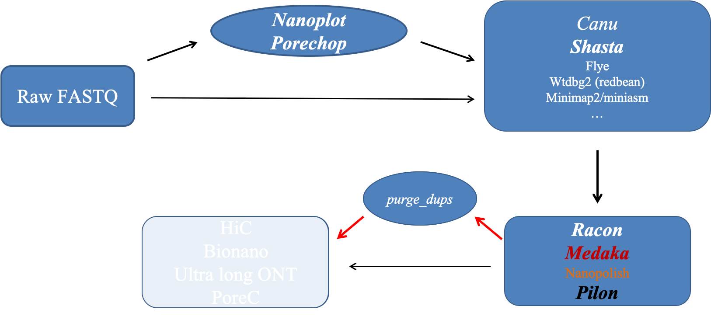

### Just a reminder of the overall workflow.

**1\.** Let's create the working directory and get the raw sequencing data. 

First, we are going to get into your own directory and create sub-directories for the raw data.

    cd /share/workshop/genome_assembly/$USER

    mkdir Nanopore; cd Nanopore
    mkdir 00-RawData; cd 00-RawData

Then, let's get the raw data. We are going to create a soft link to the data in my directory. This way, we can save both disk space and time. There are three sets of data. One is the raw Oxford Nanopore signal data, which were used for basecalling. This set of data would be required if one wants to use nanopolish for polishing the draft assembly, redo the basecall procedure using a different model, or one would like to do any analysis based on the raw signal. It is worth noting that nanopolish has been replaced by medaka for polishing. So today, we would not use this set of data. It is here so that you know that these data is available in general.

    ln -s /share/biocore/workshops/Genome-Assembly-Workshop-Jun2020/Nanopore/00-RawData/fast5_pass .

The next piece of data we need to get is the fastq files generated by basecalling, in our case using Guppy 3.0.5, which is based on the flip-flop architecture.

    ln -s /share/biocore/workshops/Genome-Assembly-Workshop-Jun2020/Nanopore/00-RawData/fastq_pass .

The final piece of data we need is Illumina sequencing data for polishing using pilon later on.

    ln -s /share/biocore/workshops/Genome-Assembly-Workshop-Jun2020/Nanopore/00-RawData/Illumina .

I always like to have a separate directory where I keep all of my scripts for running the workflow, as well as one subdirectory for storing the output from slurm.

    cd ../; mkdir scripts; cd scripts
    mkdir slurmout

---

**2\.** After obtaining the raw sequencing data and before starting an assembly, it's best to look at the raw data and know what quality of data one has in hand. The information one gets from looking at the raw data will help to make decision on the parameters in downstream analysis, or whether more data/better data should be generated. Fortunately, there is a very nice tool that one can use - [NanoPlot](https://github.com/wdecoster/NanoPlot). NanoPlot can take fastq files as input, or the sequencing_summary.txt file generated at the end of the sequencing run. We are going to copy the script to your scripts directory.

    cp /share/workshop/genome_assembly/jli/Nanopore/scripts/run_nanoplot.slurm .

This [run_nanoplot.slurm](https://raw.githubusercontent.com/ucdavis-bioinformatics-training/2020-Genome_Assembly_Workshop/master/scripts/ONT/run_nanoplot.slurm) script will submit a job to run nanoplot on the raw Oxford Nanopore sequencing data we have. The command to submit this script is as following.

    sbatch -J nnp.${USER} run_nanoplot.slurm BQC

After the job has been executed successfully, you should have a file named "BQCNanoPlot-report.html" in your 01-Nanoplot directory. It should look similar to the [report](BQCNanoPlot-report.html) I have generated. This report shows a few main quality metrics of our raw sequencing data, such as the mean read length, the median read length, the total bases yield.

---

**3\.** Once we know the quality of our sequencing data and know that we have sufficient data for assembly, we are going to apply some quality control: to remove any adpters from the reads. For Nanopore data, we use [porechop](https://github.com/rrwick/Porechop). Porechop removes sequencing adapters. If the adapter sequences are found in the middle of a read, indicating a chimera, the read is split. If one wants to use [Nanopolish](https://github.com/jts/nanopolish) to do the polish later on, then the option "\-\-discard_middle" should be used. In today's exercise, we do not use this option. We are going to use [run_porechop.slurm](https://raw.githubusercontent.com/ucdavis-bioinformatics-training/2020-Genome_Assembly_Workshop/master/scripts/ONT/run_porechop.slurm) script to carry out this step.

    cp /share/workshop/genome_assembly/jli/Nanopore/scripts/run_porechop.slurm .
    sbatch -J pcp.${USER} run_porechop.slurm

After qc, one might want to run NanoPlot again (use [run_nanoplot_qc.slurm](https://raw.githubusercontent.com/ucdavis-bioinformatics-training/2020-Genome_Assembly_Workshop/master/scripts/ONT/run_nanoplot_qc.slurm)) to check how the quality of the data has changed.

    cp /share/workshop/genome_assembly/jli/Nanopore/scripts/run_nanoplot_qc.slurm .
    sbatch -J anp.${USER} run_nanoplot_qc.slurm AQC
   
After the job has been executed successfully, you should have a file named "AQCNanoPlot-report.html" in your 01-Nanoplot directory. It should look similar to [the one](AQCNanoPlot-report.html) I have generated. When comparing to the NanoPlot report generated on raw sequencing reads, there is very small changes in our case.

---

**4\.** Now that the raw sequencing data has gone through the quality control, we can start the assembly. There are many assembly packages designed for long noisy sequencing data. We are going to use one of them: [Shasta](https://github.com/chanzuckerberg/shasta), to generate the draft assembly. I am going to provide the script for running a second assembly package: [Canu](https://canu.readthedocs.io/en/latest/). However, because it requires a very long time to run Canu, we are not going to actually run it. I will provide the assembly result that I generated by Canu. Let's get [run_shasta.slurm](https://raw.githubusercontent.com/ucdavis-bioinformatics-training/2020-Genome_Assembly_Workshop/master/scripts/ONT/run_shasta.slurm).

    cp /share/workshop/genome_assembly/jli/Nanopore/scripts/run_shasta.slurm .

**If your quality control step has finished properly**, then please run the following command to submit the script for assembly job.

    sbatch -J canu.${USER} run_shasta.slurm

**If your quality control step has not finished properly**, then please run the following command to submit the script for assembly job. This will allow the script to link the fastq files that I have generated with a successful run of the quality control step.

    sbatch -J canu.${USER} run_shasta.slurm NO

The script that we just submitted uses the default parameters from shasta package. There are many [parameters](https://raw.githubusercontent.com/ucdavis-bioinformatics-training/2020-Genome_Assembly_Workshop/master/ONT_Assembly/parms.shasta) one could modify. One of the first parameters that we could play with is the length of the marker kmers (\-\-Kmers.k). Please note that the default value for parameter "\-\-Reads.minReadLength" is 10000, which means that any read that is less than 10000 will be ignored during the assembly process. If one would like to include shorter reads in the assembly, then this parameter has to be changed.

I have generated three assemblies using Shasta, with the "\-\-Kmers.k" set as the default (10), 12 and 8, as well as one assembly using Canu with default parameters. The results are summarized in this [report](report.nb.html).

---

**6\.** Miniasm is a package created by Heng Li. It runs extremely fasta. However, the base quality in the assembly is the same as the base quality in the raw sequencing data.

    cd ../03-Miniasm-Lambda
    cp /share/workshop/jli/Nanopore/03-Miniasm-Lambda/run_miniasm.sh .

In order to run the following command, please change the last argument "jli" to your user name, which will tell the script to run everything in your directory.

    sbatch -J mini.jli run_miniasm.sh jli

---

**7\.** After generating the draft assembly, the next step is to polish it. Nanopolish is a tool that polish an assembly uses the raw signal data in its original fast5 format. We are going to use Nanopolish on the assembly generated by miniasm. The process is run in the mode that is methylation aware.

    cd ../04-Nanopolish-Lambda
    cp /share/workshop/jli/Nanopore/04-Nanopolish-Lambda/run_nanopolish.sh .

In order to run the following command, please change the last argument "jli" to your user name, which will tell the script to run everything in your directory.

    sbatch -J nnp.jli run_nanopolish.sh jli

This step includes several processes: mapping of the sequencing reads to the draft assembly, indexing all relevant files, and finally run nanopolish. Because nanopolish uses the raw current data in the sequencing, it takes some time to finish. The polishing step may be run iteratively until consensus quality converge.

---

**8\.** Now that we have two draft assemblies and one polished assembly, we can align one to another to see the difference between assembly packages, or the effect of the polishing process.

    cd ../04-Mummer-Lambda
    cp /share/workshop/jli/Nanopore/04-Mummer-Lambda/run_nucmer.sh .

In order to run the following command, please change the last argument "jli" to your user name, which will tell the script to run everything in your directory.

    sbatch -J nuc.jli run_nucmer.sh jli

When the job finishes, we should have a file named "lambda.draft.png" in the working directory. We can download it to our laptop for viewing. This script aligns the draft assembly from miniasm to the draft assembly from canu. The assembly from canu is on the x axis. You can modify the script to generate the alignment of the polished assembly to the draft assembly from miniasm. The one I generated is .

We can also generate similar plot between the assemblies and the reference genome. Please get a copy of the reference genome using the following command. Then you should be able to use the above script (with modification) to accomplish the goal.

    ln -s /share/biocore/projects/Internal_Jessie_UCD/Nanopore/References/lambda_ref.fasta .

