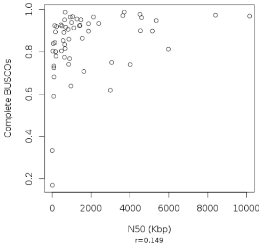
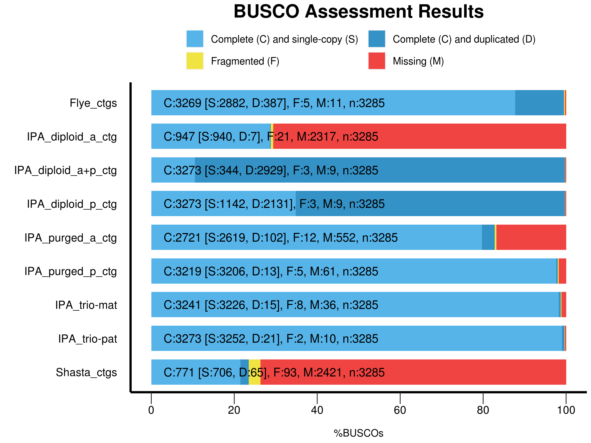

### Schedule
*  1pm Intro and bacterial BUSCO hands on: 20 minutes
*  1:20pm Team part 1: 20 minutes in break out rooms
    - setup and run BUSCO on Drosophila assemblies
* 1:40pm Presentation about how BUSCO works: 20 minutes
* 2pm Team part 2: 20 minutes in breakout rooms
    - Evaluate BUSCO results
    - Prepare presentation
* 2:20pm Team Presentations: 25 minutes 
    - Teams 1-5, 5 minutes each
* 2:50pm Extra credit if time permits.


### Intro

**Benchmarking Universal Single-Copy Orthologs**, [BUSCO](https://doi.org/10.1093/bioinformatics/btv351), is a popular software package for assessing genome/transcriptome assembly completeness using single copy orthologs. It was published in Oct 2015 and had 3486 citations as of July 2020 according to Google Scholar! [The authors](https://www.sib.swiss/evgeny-zdobnov-group) are also responsible for [OrthoDB](https://www.orthodb.org/), a large database of curated [orthologous genes](https://www.orthodb.org/orthodb_userguide.html#terminology). 

------


### How are BUSCOs made? 


The BUSCO sets are collections of nearly universally distributed (90%) single-copy orthologous genes found within species at a specific phylogenetic level. Originally these sets represented arthropods, vertebrates, metazoans, fungi, and eukaryotes, but additional genome sequences have made it possible to create BUSCO sets at a finer scale.

These sets are determined by analysis of species in the OrthoDB database. [The theory](https://academic.oup.com/gbe/article/doi/10.1093/gbe/evq083/573552) is that genes belonging to these sets are evolving under "single-copy control" where something about their necessity and dosage constraints maintains them at a single copy within the genome.

If a newly assembled genome or transcriptome is missing genes from the corresponding BUSCO set, something may have gone wrong with sequencing/assembly/annotation/etc, and other genes may also be missing.


1. Selection: Single-copy orthologs present in at least 90% of species in a specific group are selected from OrthoDB.

1. Model Building: Multiple sequence alignments of protein sequences from each BUSCO group are generated and used to build a hidden Markov model (HMM) for the group.

1. Pruning: Sequences are then searched against the library of HMM profiles to remove any that cannot reliably distinguish members of their group from other sequences.

1. Parameter Optimization: "expected-score" and "expected-length" classification cut-offs are calculated for each BUSCO group based on the distribution of HMM search scores and lengths for members of the group. These cut-offs well be used to classify new proteins as members of the group.

1. Consensus sequences and Block profiles (position-specific frequency matrices) for each BUSCO are then created.


-----

### How are genomes/transcriptomes assessed?

1. Consensus sequences for each BUSCO are searched against the genome sequence using tBLASTn. Regions containing potential BUSCOs are identified. Up to three candidate genomic regions can be identified for each BUSCO. 

1. Candidate regions are extracted from the genome and [AUGUSTUS/Augustus](http://augustus.gobics.de/) in combination with the BUSCO block profile is used for gene prediction. For transcriptomes,the protein prediction is used directly if available, otherwise the longest ORF within the transcript is used.

1. Each predicted gene is then matched against the BUSCO group's HMM profile, sequences meeting the minimum alignment cut-off are considered orthologous.

1. Orthologous sequences are then evaluated based on the expected-length cutoff. Sequences are classified as "Complete" if they meet the length cutoff, or "Fragmented" if too short. If multiple sequences meet the alignment and length cutoff they are classified as "Duplicated". Any BUSCO without Complete, Fragmented, or Duplicated sequence is "Missing".

1. Finally, "Complete" sequences are used to build a new gene prediction model for Augustus. A second round of Augustus gene prediction is then performed on all BUSCO-matching candidate regions that did not yield a "Complete" ortholog. Classification is then carried out a second time on the new set of predicted genes.

--------

BUSCO scores and contiguity as defined by N50 are not well correlated:



[Simão et al. 2015](https://academic.oup.com/bioinformatics/article/31/19/3210/211866)

---------

### Hands on, Activating/Installing BUSCO

First we need to set up BUSCO.

#### Create an interactive session:
```bash
srun -t 03:00:00 -c 20 -n 1 --mem 16000 --partition production --account genome_workshop --reservation genome_workshop --pty /bin/bash
aklog 
source ~/.bashrc  # only necessary if you have a ~/.bashrc

```

### Get access to BUSCO:

#### Option 1 Run BUSCO using modules 

```bash
mkdir -p /share/workshop/genome_assembly/$USER/busco
cd /share/workshop/genome_assembly/$USER/busco

module load busco/4.0.2

cp -r /share/biocore/shunter/2020-Genome_Assembly_Workshop/busco/augustus.config /share/workshop/genome_assembly/$USER/busco/
export AUGUSTUS_CONFIG_PATH=/share/workshop/genome_assembly/$USER/busco/augustus.config

cp /share/biocore/shunter/2020-Genome_Assembly_Workshop/busco/busco_config.ini /share/workshop/genome_assembly/$USER/busco/
export BUSCO_CONFIG_FILE=/share/workshop/genome_assembly/$USER/busco/busco_config.ini

cp /share/biocore/shunter/2020-Genome_Assembly_Workshop/busco/generate_plot.py /share/workshop/genome_assembly/$USER/busco/

busco --help

```

<font color="red">Once you have successfully run `busco --help` mark "Yes" in zoom. Post questions or problems to the Slack channel.</font>

-------

#### Option 2 Install BUSCO using Conda

<font color="red">This option is for patient people or people who need to install BUSCO on a system where no module is available.</font>

*If you go this route, you will not need to set environment variables or copy generate_plot.py as in Option 1.*

```bash
mkdir -p /share/workshop/genome_assembly/$USER/busco
cd /share/workshop/genome_assembly/$USER/busco
```

##### Download miniconda:

See: https://docs.conda.io/en/latest/miniconda.html for more details

```bash
wget https://repo.anaconda.com/miniconda/Miniconda3-latest-Linux-x86_64.sh
```

##### Install it to your workshop folder:

```bash
sh Miniconda3-latest-Linux-x86_64.sh -b -p /share/workshop/genome_assembly/$USER/busco/miniconda
```

##### Activate this new Conda install:

```bash
eval "$(/share/workshop/genome_assembly/$USER/busco/miniconda/bin/conda shell.bash hook)"
```

##### Add some channels, update Conda:

```bash
conda config --add channels defaults
conda config --add channels bioconda
conda config --add channels conda-forge
conda update --all
```

##### Create a new environment and install Busco:

Note that this step can take **a very long time** because Busco has a large number of dependencies. This set also sets the AUGUSTUS_CONFIG_PATH and BUSCO_CONFIG_FILE environment variables.

```bash
conda create -n busco_env
conda activate busco_env
conda install busco=4.0.6
```

----------

### Test BUSCO on a bacterial genome.

We need a genome to test on, lets start by assembling a small bacterial one.

The following code block symlinks in some raw Illumina reads and does some basic read clean up with [HTStream](https://github.com/s4hts/HTStream/issues).

```bash
# NOTE: Create an interactive session on the cluster if you closed the previous one.
cd /share/workshop/genome_assembly/$USER/busco
mkdir -p bacterial_test
cd bacterial_test

# Setup Raw Data
mkdir 00-RawData
ln -s /share/biocore/shunter/bacteria/*.gz ./00-RawData/

# Clean reads:
module load htstream/1.3.1
mkdir -p 01-HTS_Preproc

hts_Stats -L 01-HTS_Preproc/Bacteria.json -1 00-RawData/Bacteria_R1.fastq.gz -2 00-RawData/Bacteria_R2.fastq.gz | \
hts_SuperDeduper -A 01-HTS_Preproc/Bacteria.json | \
hts_SeqScreener -A 01-HTS_Preproc/Bacteria.json | \
hts_AdapterTrimmer -A 01-HTS_Preproc/Bacteria.json | \
hts_Stats -A 01-HTS_Preproc/Bacteria.json -F -f 01-HTS_Preproc/Bacteria

```

Next we assemble the cleaned reads with [Spades](http://cab.spbu.ru/software/spades/) and look at the assembly statistics.

```bash
module load spades/3.13.0
spades.py -t 20 -1 01-HTS_Preproc/Bacteria_R1.fastq.gz -2 01-HTS_Preproc/Bacteria_R2.fastq.gz -o 02-SpadesAssembly

module load assembly_stats/1.0.1

assembly_stats ./02-SpadesAssembly/contigs.fasta
```

```R
stats for ./02-SpadesAssembly/contigs.fasta
sum = 1113800, n = 60, ave = 18563.33, largest = 389847
N50 = 82313, n = 3
N60 = 75116, n = 5
N70 = 54132, n = 6
N80 = 37018, n = 9
N90 = 12161, n = 15
N100 = 128, n = 60
N_count = 0
Gaps = 0
```

<font color="red">Once you have successfully completed this step mark "Yes" in zoom. Post questions or problems to the Slack channel.</font>

-------

**Wow, an N50 of only 82Kb?**


#### Run BUSCO in genome assessment mode

We will use new features in BUSCO V4: better support for bacteria and archaea, auto-lineage selection, and automated download of reference datasets (all of which are very nice!). To speed things up we can ask Busco to only search the prokaryotic lineage using --auto-lineage-prok.

```bash 

busco -f -c 20 -m genome -i ./02-SpadesAssembly/contigs.fasta -o 03-Busco --auto-lineage-prok

```

```
        --------------------------------------------------
        |Results from dataset mycoplasmatales_odb10       |
        --------------------------------------------------
        |C:98.9%[S:98.3%,D:0.6%],F:1.1%,M:0.0%,n:174      |
        |172    Complete BUSCOs (C)                       |
        |171    Complete and single-copy BUSCOs (S)       |
        |1      Complete and duplicated BUSCOs (D)        |
        |2      Fragmented BUSCOs (F)                     |
        |0      Missing BUSCOs (M)                        |
        |174    Total BUSCO groups searched               |
        --------------------------------------------------
```

This isolate had previously been identified as *Mycoplasma ovipneumoniae* and Busco has identified it as part of the Mycoplasmatales family. The assembly looks like it captured almost all of the single copy genes. If we look into the Busco folders we can find some additional interesting information about the genome. Note that because this sample was a prokaryote Busco used, [Prodigal](https://github.com/hyattpd/Prodigal) to do gene prediction instead of Augustus.


Rather than use BUSCO's auto-lineage selection, we can also look through the BUSCO database and specify the lineage directly if we have a good identification for the sample. This will cause BUSCO to run more quickly:

```bash
busco --list-datasets

busco -f -c 20 -m genome -i ./02-SpadesAssembly/contigs.fasta -o 03-Busco_lineage --lineage_dataset mycoplasmatales_odb10

```

Finally we can generate the canonical BUSCO plot using a script that comes with the BUSCO package. However we need to install the ggplot2 package in R first.

Start R and run the following:

(answer yes to install the package to your personal library)

```R
install.packages("ggplot2")
q(save="no")
```

Next, copy the summary files and make the plot:

```bash
mkdir -p short_summaries
cp ./03-Busco/short_summary.* ./short_summaries/ 
cp ./03-Busco_lineage/short_summary.* ./short_summaries/
python3 /share/workshop/genome_assembly/$USER/busco/generate_plot.py -wd ./short_summaries/

```


Note that each of the summary files has been incorporated in the plot. This may be helpful in comparing different assemblies.

<font color="red">Once you have successfully completed this step mark "Yes" in zoom. Post questions or problems to the Slack channel.</font>

---------


## Team exercise: Test Busco on *Drosophila* HiFi assemblies.

-------

## <font color="red">First, exit your srun session if you haven't already. We will need all of the cluster resources for the next step.</font>

### Stop until `squeue --reservation genome_workshop` is empty

-------


Additional assemblies were built with:
1. Shasta version 0.5.1 using command:
    * shasta --input ELF_19kb.m64001_190914_015449.Q20.28X.fasta
1. Flye v2.7.1 using command:
    * python ./Flye/bin/flye -t 40 --pacbio-hifi ELF_19kb.m64001_190914_015449.Q20.28X.fasta --out-dir flyeasm

Setup: 

```bash 
cd /share/workshop/genome_assembly/$USER/busco/

mkdir -p drosophila_test
cd drosophila_test
```


#### Team 1: IPA primary contigs from Trio-binned Maternal assembly vs IPA Paternal assembly

HiFi reads for this assembly were binned based on Illumina kmers.

```
/share/workshop/genome_assembly/pacbio_2020_data_drosophila/hifi_long_read_mat_ipa_assembly/RUN/14-final/final.p_ctg.fasta
/share/workshop/genome_assembly/pacbio_2020_data_drosophila/hifi_long_read_pat_ipa_assembly/RUN/14-final/final.p_ctg.fasta
```

#### Team 2: IPA primary + accessory contigs vs Shasta contigs

```
/share/workshop/genome_assembly/pacbio_2020_data_drosophila/hifi_long_read_diploid_ipa_assembly/RUN/14-final/final.*.fasta
/share/biocore/shunter/drosophila/ShastaRun/Assembly.fasta
```


#### Team 3: IPA primary + accessory contigs vs Flye contigs

```
/share/workshop/genome_assembly/pacbio_2020_data_drosophila/hifi_long_read_diploid_ipa_assembly/RUN/14-final/final.*.fasta
/share/biocore/shunter/drosophila/flyeasm/assembly.fasta
```


#### Team 4: IPA primary contigs vs IPA accessory contigs after purge duplicates

```
/share/workshop/genome_assembly/pacbio_2020_data_drosophila/purge_dup_asm/final.purged.a_ctg.fasta
/share/workshop/genome_assembly/pacbio_2020_data_drosophila/purge_dup_asm/final.purged.p_ctg.fasta
```


#### Team 5: IPA contigs after purge_dups vs IPA primary contigs

```
/share/workshop/genome_assembly/pacbio_2020_data_drosophila/purge_dup_asm/final.purged.p_ctg.fasta
/share/workshop/genome_assembly/pacbio_2020_data_drosophila/hifi_long_read_diploid_ipa_assembly/RUN/14-final/final.p_ctg.fasta
```


#### Extra Credit:

```
/share/biocore/shunter/drosophila/ShastaRun/Assembly.fasta
/share/biocore/shunter/drosophila/flyeasm/assembly.fasta
```

-------------

### Team Instructions

### Part 1 (20 minutes in breakout rooms)

<font color="red">If problems or questions arise during this section, post them into the Slack channel and a TA will join your breakout room to help.</font>

1. Choose someone from the group to be the team lead and communicator. This person will be responsible for posting team results to the appropriate Slack thread, collating the results, and presenting them to the group. **This person should post a brief message to the Slack channel introducing their team and starting the team thread.**

1. Generate assembly statistics for the two genome assemblies you have been assigned. **Paste these into the Slack thread for your team. Make sure to label them clearly with the contig set!**

1. Discuss the assembly statistics as a group. Form some hypotheses about how the BUSCO scores will look. What are you expectations for a Drosophila genome? What do you know about how the assembly was done? **Record these hypotheses and your rational.**

1. As a team, figure out the proper commands for running BUSCO on the two assemblies assigned to your team. 
    * Use the "--lineage_dataset" option to speed up analysis. Figure out which BUSCO set is appropriate to use (hint: _Drosophila melanogaster_ is in order _Diptera_).
    * Configure BUSCO to use 40 cpus.
    * **Paste your solution into the Slack chat under your team's thread.**
    * Note: <font color="red">Don't start BUSCO yet (see next steps).</font>

1. Designate two people in from your team to run BUSCO. Assign one assembly to each.

1. Use srun to start an interactive session with **40 CPU** cores and 32 gigs of RAM. Start BUSCO and make sure that it is running correctly. (Alternatively build an sbatch script and submit the runs as a job). <font color="red">Remember to only submit two BUSCO jobs per team, there are not enough CPU resources for more than this.</font>

1. Announce in the Slack channel that your team has completed Part 1 and leave your breakout room.

-------

### Part 2 (10-20 minutes)

1. Once BUSCO has finished for both assemblies, paste the full path to the BUSCO results to your group's slack channel. Remember to label it clearly.

1. Aggregate the "short_summary.*" files from both of your contig sets. Make a BUSCO plot. Discuss and compare the results and evaluate your hypotheses.

1. Prepare a short presentation (~3 slides, 5 minutes) with your observations about the assembly statistics, initial hypotheses, BUSCO results and final conclusions.

1. Leave your breakout room and announce on the Slack channel that your group is ready to present.


### Extra Credit Part 3 (?? minutes)

1. Go through the Slack threads for each group. Collect that BUSCO output paths for each different set of contigs.

1. Collate all of the statistics and compare the results. Which assembler did better? 



#### Assessment
**Fly contigs:**
* Very few missing or fragmented, some duplicates.
    
**IPA_diploid_a:**
* IPA doesn't do a great job of binning haplotids, so the accessory set is missing many of them.

**IPA_diploid_p:**
* In the same way as IPA accessory contigs missing some genes, IPA primary contigs are excepted to have mostly complete BUSCOs but lots of duplicates. This is exactly what we see.
    
**IPA_diploid_a+p:**
* The combination of IPA_diploid_a + IPA_diploid_P (accessory and primary) contigs should result in fully complete, and mostly duplicated BUSCOs. This is exactly what we see.
    
**IPA_purged_a_ctg / IPA_purged_p_contig:**
* These sets of contigs have had purge duplicates run on them. This should remove duplicated genes, resulting in sets of contigs that contain most BUSCOs in single copy.
* This is mostly true, however the accessory set is missing a number, and also has a number of duplicates.
    
**IPA_trio-mat / IPA_trio-pat:**
* For both of these contig sets, reads had been binned prior to assembly using the Trio binning approach. We would expect this binning to produce beautiful haploid assemblies. With some small exception, this is almost exactly what we see.
    
**Shasta:**
* Shasta is not designed for PacBio HiFi data and it shows. The Shasta assembly has the largest number of fragmented contigs, and is missinge a huge number of BUSCOs as well.