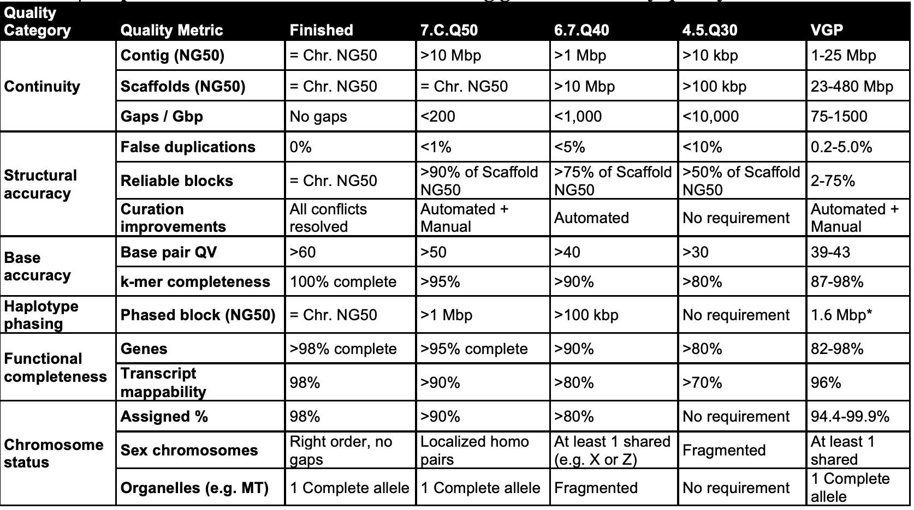
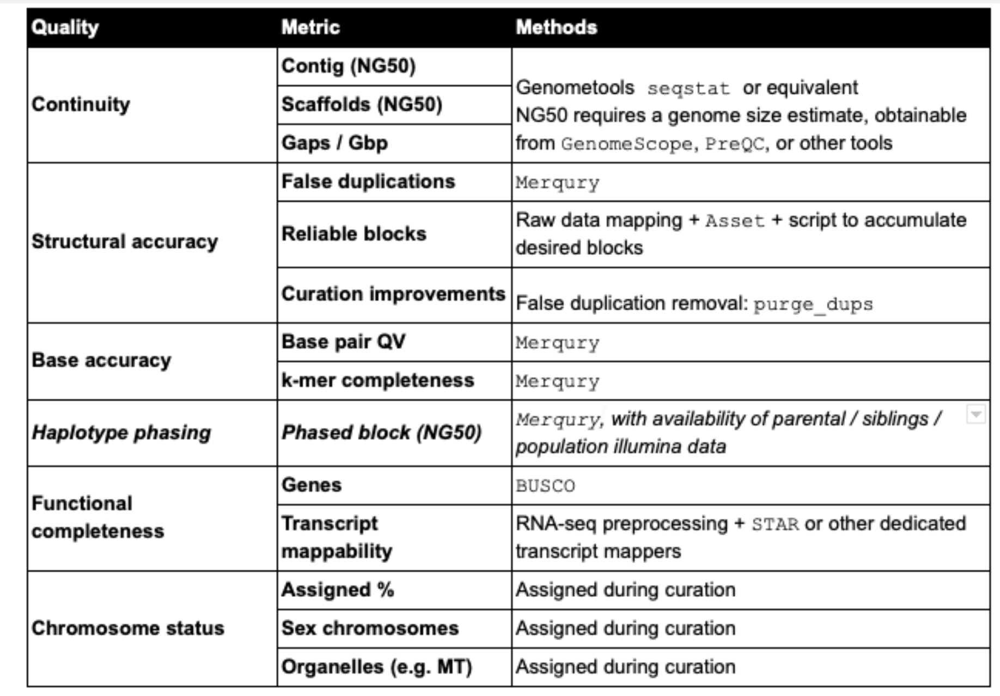

Make sure our workspace is setup properly and request resources on the cluster
```bash
mkdir -p /share/workshop/genome_assembly/$USER
cd /share/workshop/genome_assembly/$USER

srun -t 06:00:00 -c 24 -n 1 --mem 32000 --partition production --account genome_workshop --reservation genome_workshop --pty /bin/bash
aklog
```

# Assessing Assembly Completeness

The VGP and EBP has published a set of [Draft](https://www.earthbiogenome.org/standards-1/2020/7/9/assembly-standards-sequencing-and-assembly-subcommittee) Assembly Statistics to aspire to.

They propose six broad quality categories (see table below)
    * Continuity
    * Structural accuracy
    * Base accuracy
    * Haplotype phasing
    * Functional completeness
    * Chromosome status



The 1st column are split into sub-metrics in the 2nd column. The recommendations for draft to finished qualities (columns 3–6) are based on those achieved in past studies, this study, and what we aspire to.

Quality of an assembly can be expressed in a 3 value notation, X.Y.Q = contig NG50 log10 value; scaffold NG50 log10 value; and QV value.

### Assembly metrics

<dl>
  <dt><strong>N50</strong></dt>
  <dd>N50 statistic defines assembly quality in terms of contiguity. Given a set of contigs, the N50 is defined as the sequence length of the shortest contig at 50% of the total genome length.  N50 can be described as a weighted median statistic such that 50% of the entire assembly is contained in contigs or scaffolds equal to or larger than this value.</dd>
  <dt><strong>L50</strong></dt>
  <dd>Given a set of contigs, each with its own length, the L50 count is defined as the smallest number of contigs whose length sum makes up half of genome size.</dd>
  <dt><strong>N90</strong></dt>
  <dd>The N90 statistic is less than or equal to the N50 statistic; it is the length for which the collection of all contigs of that length or longer contains at least 90% of the sum of the lengths of all contigs.</dd>
  <dt><strong>NG50</strong></dt>
  <dd>Note that N50 is calculated in the context of the assembly size rather than the genome size. Therefore, comparisons of N50 values derived from assemblies of significantly different lengths are usually not informative, even if for the same genome. To address this, the authors of the Assemblathon competition came up with a new measure called NG50. The NG50 statistic is the same as N50 except that it is 50% of the known or estimated genome size that must be of the NG50 length or longer. This allows for meaningful comparisons between different assemblies.</dd>
</dl>

<!--In the typical case that the assembly size is not more than the genome size, the NG50 statistic will not be more than the N50 statistic.-->

### Additional Requirements

Our experience has shown that currently, all (combinations of) automated processes generate assemblies with a variety of remaining errors, some of which are relatively easy to address and should be corrected before submission.  We therefore propose that a set of quality control criteria are required to be met including:

1. separation of sequence of the target species from contaminants and other organisms such as symbionts/cobionts

1. explicit identification of a primary (haploid or pseudo-haploid) assembly, with additional sequence in a secondary bin that may contain either full alternate haplotypes or a set of haplotypic/other sequence from the individual

1. separation and explicit identification of organellar genomes

1. only A,C,G,T and N bases and removal of trailing Ns

We also encourage:

1. identification of discordances between raw data and resulting assembly to locate and remove structural errors (misjoins, missed joins and false duplications)

1. identification of sex chromosomes where possible

1. reconciliation with the known karyotype where it exists and this is possible.

### Applications



## Preforming some metrics

### genometools seqstat

We can use genometools to get a number of assembly stats. In order to get NG50 values we need to provide it the estimate of the genome size determined by genomescope.

```bash
mkdir genometools
cd genometools
module load genometools/1.5.9
gt seqstat -contigs -genome 135000000 /share/workshop/genome_assembly/pacbio_2020_data_drosophila/hifi_long_read_diploid_ipa_assembly/RUN/14-final/final.p_ctg.fasta > diploid_ipa_assembly.stats
```

```
# number of contigs:     208
# genome length:         135000000
# total contigs length:  232197789
#    as % of genome:     172.00 %
# mean contig size:      1116335.52
# contig size first quartile: 78104
# median contig size:         148967
# contig size third quartile: 534433
# longest contig:             23464522
# shortest contig:            50222
# contigs > 500 nt:           208 (100.00 %)
# contigs > 1K nt:            208 (100.00 %)
# contigs > 10K nt:           208 (100.00 %)
# contigs > 100K nt:          135 (64.90 %)
# contigs > 1M nt:            37 (17.79 %)
# N50:                   7970785
# L50:                   9
# N80:                   1615167
# L80:                   29
# NG50:                  12556253
# LG50:                  4
# NG80:                  8941183
# LG80:                  8
```

Now lets take a look at the purged duplicates result.

```bash
gt seqstat -contigs -genome 135000000 /share/workshop/genome_assembly/pacbio_2020_data_drosophila/purge_dup_asm/final.purged.p_ctg.fasta > purged_ipa_assembly.stats
```

```
# number of contigs:     70
# genome length:         135000000
# total contigs length:  134186888
#    as % of genome:     99.40 %
# mean contig size:      1916955.54
# contig size first quartile: 105276
# median contig size:         314579
# contig size third quartile: 1030361
# longest contig:             23466353
# shortest contig:            50196
# contigs > 500 nt:           70 (100.00 %)
# contigs > 1K nt:            70 (100.00 %)
# contigs > 10K nt:           70 (100.00 %)
# contigs > 100K nt:          54 (77.14 %)
# contigs > 1M nt:            17 (24.29 %)
# N50:                   13488756
# L50:                   4
# N80:                   2484305
# L80:                   9
# NG50:                  13488756
# LG50:                  4
# NG80:                  2121280
# LG80:                  10
```

### MERQURY

Merqury got alot of its inspiration from [KAT K-mer Analysis Toolkit](https://kat.readthedocs.io/en/latest/using.html)
First we need some dependancies. Gonzalo Garcia from the Earlham Institute in the UK contributed to the last Genome Assembly workshop in 2018 discussing k-mers and KAT. Can see his materials [here](https://ucdavis-bioinformatics-training.github.io/2018-Dec-Genome-Assembly/).

Merqury

R requires
Loading required package: argparse
Loading required package: ggplot2
Loading required package: scales

```bash
mkdir merqury_drosophila
cd merqury_drosophila/
ln -s /share/workshop/genome_assembly/pacbio_2020_data_drosophila/hifi_long_read_data/ELF_19kb.m64001_190914_015449.Q20.38X.fasta .
ln -s /share/workshop/genome_assembly/pacbio_2020_data_drosophila/purge_dup_asm/final.purged.*.fasta .

module load R
# Need argparse, ggplot2, scales
Rscript -e 'install.packages(c("argparse", "ggplot2", "scales"),repos = "http://cran.us.r-project.org")'

module load samtools
module load bedtools2
module load java/jdk11.0
module load igvtools

wget https://github.com/marbl/meryl/releases/download/v1.0/meryl-1.0.Linux-amd64.tar.xz
tar -xf meryl-1.0.Linux-amd64.tar.xz
export PATH=$PWD/meryl-1.0/Linux-amd64/bin:$PATH
```

Creating Meryl counts of the high quality PacBio HiFi data.
```bash
meryl count k=21 ELF_19kb.m64001_190914_015449.Q20.38X.fasta output pacbio.meryl
# This takes quite some time 30+ minutes
# Alternatively you can link mine
#ln -s /share/workshop/genome_assembly/msettles/merqury_drosophila/pacbio.meryl .
```

```bash
git clone https://github.com/marbl/merqury.git
export MERQURY=$PWD/merqury
ln -s $MERQURY/merqury.sh

less merqury.sh
```


```bash
./merqury.sh pacbio.meryl final.purged.p_ctg.fasta final.purged.a_ctg.fasta merqury_pacbio
# Took about an hour
```
