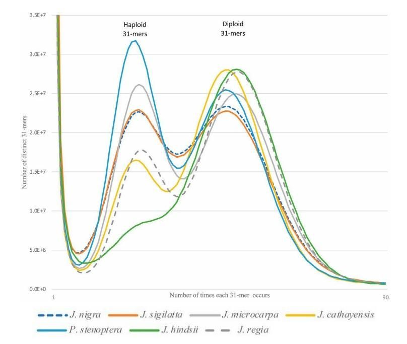
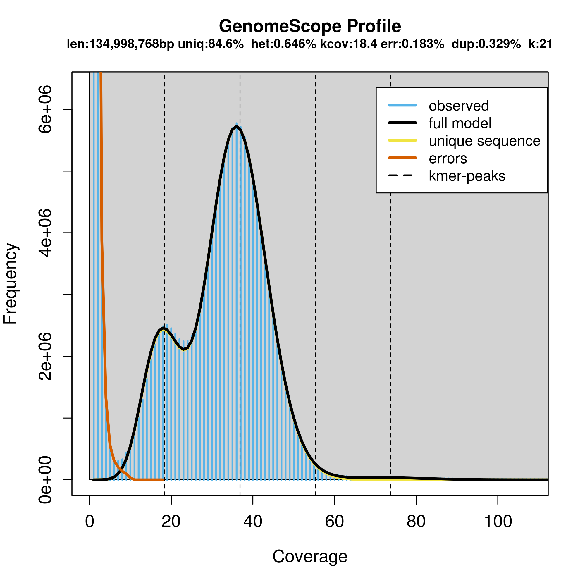

Make sure our workspace is setup properly

```bash
mkdir -p /share/workshop/genome_assembly/$USER
cd /share/workshop/genome_assembly/$USER
```

# K-mer frequency plots

We can use K-mers (sequences of length K) to estimate biases, repeat content, sequencing coverage, and heterozygosity.

It is always a good idea to plot K-mer frequencies to get a picture of the genome composition and sequencing coverage/quality. For example, haploid and diploid genomes have differing K-mer distributions.



The 31-mer histograms of paired-end sequence data. Each histogram shows a bimodal distribution typical of a diploid heterozygous genome. The relative fraction of the distribution under the left (haploid) peak is proportional to the genome heterozygosity. Using the relative proportions of the two peaks the genomes can be ranked by their heterozygosity.

    Kristian A. Stevens, Keith Woeste, Sandeep Chakraborty, Marc W. Crepeau, Charles A. Leslie, Pedro J. Martínez-García, Daniela Puiu, Jeanne Romero-Severson, Mark Coggeshall, Abhaya M. Dandekar, Daniel Kluepfel, David B. Neale, Steven L. Salzberg, Charles H. Langley, Genomic Variation Among and Within Six Juglans Species, G3: GENES, GENOMES, GENETICS July 1, 2018 vol. 8 no. 7 2153-2165. doi: 10.1534/g3.118.200030."

## What are K-mers

A **K-mer** is a substring of length K in a string of DNA bases. For example: All 2-mers of the sequence AATTGGCCG are AA, AT, TT, TG, GG, GC, CC, CG. Similarly, all 3-mers of the sequence AATTGGCCG are AAT, ATT, TTG, TGG, GGC, GCC, CCG. There are an exponentially increasing number of possible K-mers for increasing numbers of K. There are 16 possible 2-mers for DNA if we assume there are only 4 types of bases (A,T,G,C). The equation for the number of K-mers possible for a given K is then 4^K.

|Bases|K-mer size|Total possible kmers|
|---|---|---|
|4|1|4|
|4|2|16|
|4|3|64|
|4|4|256|
|4|5|1,024|
|4|6|4,096|
|4|7|16,384|
|4|8|65,536|
|4|9|262,144|
|4|10|1,048,576|
|4|…|…|
|4|21|4.4e+12|
|4|27|1.8e+16|
|4|31|4.6e+18|

As you can see, there are 64 possibilities for a 3-mer and over 4 Trillion possibilities for a 21-mer!

For a given sequence of length L,  and a K-mer size of K, the total k-mer’s possible will be given by ( L – k ) + 1

e.g. For the sequence of length of 14 , and a K-mer length of 8, the number of K-mer’s generated will be:

**GATCCTACTGATGC**

    n   = ( L - K ) + 1
        = (14 - 8 ) + 1
        = 7

**GATCCTAC,     ATCCTACT,     TCCTACTG,     CCTACTGA,     CTACTGAT,     TACTGATG,     ACTGATGC**

For shorter fragments, as in the above example, the total number of K-mers estimated is n = 7, which it is not close to actual fragment size of L which is 14 bps.  But for larger fragments , the total number of K-mer’s (n) provide a good approximation to the actual genome size. The following table tries to illustrate the approximation:

K=18		

|Genome Sizes| Total K-mers of k=18|% error in genome estimation
|---|---|---|
|L|N=(L-K)+1||
|100|83|17|
|1000|983|1.7|
|10000|9983|0.17|
|100000|99983|0.017|
|1000000|999983|0.0017

So for a genome size of 1 Mb and K-mer size of 18, the error between estimation and reality is only .0017%. Which is a very good approximation of actual size.

In choosing a K-mer size, it should be large enough to allow the K-mer to map uniquely to the genome. So the total available K-mers should be sufficiently larger than the genome size and therefor has the ability to store all the K-mers in the genome (a K-mer size of 21 is large enough for most genomes). However, too large K-mers leads to need for substantial computational resources, as well as producing more erroneous K-mers caused by sequencing errors. In other words, the higher error rate in the sequencing data, the smaller k-mer size should be used.  Extremely large (haploid size >>10GB) and/or very repetitive genomes may benefit from larger kmer lengths to increase the number of unique k-mers.

### Genome copies

A significant issue that we face in a real genome sequencing project is non-uniform coverage of genome. This is attributed to both technical and biological variables.

ex:  amplification bias of certain genomic regions during PCR (a step in preparation of Illumina sequencing libraries) [Technical] and presence of repetitive sequences in genome [Biological].

Extending the above example, if we had 10 copies (C) of 1Mb genome, then the total no of K-mer’s seen (n) of length k = 21 will be 9999700.

    n   = [( L - k ) + 1 ] * C
        = [(1000000 - 21 ) + 1] * 10
        = 9999700


To get the fragement size (ala genome size), we simply need to divide the total by the number of copies:

    L   = n / C
        = 9999700 / 10
        = 9999700

The above example helps to understand that we never sequence a single copy of genome but rather a population. Rather we end up sequencing C copies of genome. This is also referred as coverage in sequencing. To obtain actual genome size (N), divide the total K-mers seen (n) by coverage (C).

    N  = n / C

## Estimating genome characteristics

In the first step, a K-mer frequency is calculated. There are software tools that help in finding the K-mer frequency in sequencing projects. The K-mer frequency of a shotgun library follows a pseudo-normal distribution (actually it is a Poisson distribution) around the mean coverage.

### K-mer counting tools

* [Jellyfish](https://github.com/gmarcais/Jellyfish)
* [kmerfreq](https://github.com/fanagislab/kmerfreq)
* [KMC3](https://github.com/refresh-bio/KMC)
* [DSK](https://github.com/GATB/dsk)
* [KCMBT](https://github.com/abdullah009/kcmbt_mt)
* [BFCounter](https://github.com/pmelsted/BFCounter)
* [GenomeTester4](https://github.com/bioinfo-ut/GenomeTester4)

#### Computing K-mer frequencies with Jellyfish
Lets first get an interactive session on the cluster
```bash
cd /share/workshop/genome_assembly/$USER
srun -t 03:30:00 -c 8 -n 1 --mem 32000 --partition production --account genome_workshop --reservation genome_workshop --pty /bin/bash
```

Running jellyfish, here we use a K-mer size of 21. You should always use "canonical kmers" (-C) since the sequencing reads will come from both the forward and reverse strand of DNA.
```bash
module load jellyfish
jellyfish count -C -m 21 -s 1000000000 -t 8 /share/workshop/genome_assembly/pacbio_2020_data_drosophila/hifi_long_read_data/ELF_19kb.m64001_190914_015449.Q20.38X.fasta -o reads.jf

jellyfish histo -t 8 reads.jf > reads.histo
```

### K-mer frequencies

Once the K-mer frequencies are calculated a histogram can be plotted to visualize the distribution.

Download the [K-mer frequencing table](https://raw.githubusercontent.com/ucdavis-bioinformatics-training/2020-Genome_Assembly_Workshop/master/kmers/reads.histo)

```R
spec1_21 <- read.table("reads.histo")
colnames(spec1_21) <- c("freq","k21")

summary(spec1_21)
barplot(spec1_21$k21)
barplot(spec1_21$k21,xlim=c(0,100),ylim=c(0,5000000))

# genome size estimate
error=7
peak=36
g_est = round(sum(as.numeric(spec1_21[error:nrow(spec1_21),1]*spec1_21[error:nrow(spec1_21),2]))/peak, digits=0)
g_est
# [1] 139970181

# Single copy sum
singlecopy=60
singleC = round(sum(as.numeric(spec1_21[error:singlecopy,1]*spec1_21[error:singlecopy,2]))/peak, digits=0)
singleC
# [1] 116938146

# Percent in single copy
psinglecopy <- round(singleC/g_est, digits=2)
psinglecopy
# [1] 0.84

# Estimated coverage
total_bp <- 5319759793
cov <- round(total_bp/g_est, digits=2)
cov
# [1] 38.01
```

## Genomescope

[Genomescope](https://github.com/schatzlab/genomescope) is an R script that uses k-mer frequencies generated from raw read data to estimate the genome size, abundance of repetitive elements and rate of heterozygosity.

There is also an online version, which offers all of the same functionality in an easy to use [web interface](http://genomescope.org/)

Running on the command line

    Rscript genomescope.R histogram_file k-mer_length read_length output_dir [kmer_max] [verbose]

```bash
cd /share/workshop/genome_assembly/$USER
git clone https://github.com/schatzlab/genomescope.git
module load R
Rscript ./genomescope/genomescope.R reads.histo 21 19000 genomescope_reads
```

The Rscript generates a directory called "genomescope_reads" with the following files

* model.txt
* plot.log.png
* plot.png
* progress.txt
* summary.txt

The summary.txt show the following results
```
GenomeScope version 1.0
k = 21

property                      min               max
Heterozygosity                0.645301%         0.647448%
Genome Haploid Length         134,957,059 bp    134,998,768 bp
Genome Repeat Length          20,721,599 bp     20,728,003 bp
Genome Unique Length          114,235,461 bp    114,270,765 bp
Model Fit                     96.7426%          97.8227%
Read Error Rate               0.182922%         0.182922%
```

The two plots allow you to visualize the K-mer frequencies
<p float="center">
  
  
</p>

The large number of unique (near unique) K-mers that have a frequency of 1-7 (the extreme left side of the graph) is due to technical error in sequencing. The big peak at 36 in the graph above is in fact the homozygous portions of the genome that account for the identical 21-mers from both strands of the DNA. The dotted line corresponds to the predicted center of that peak. The small peak/shoulder to the left of the peak corresponds to the heterozygous portions of the genome that accounts for different 21-mers from each strand of the DNA. The two dotted lines to the right of the main peak (at coverage = 54 and 72) are the duplicated heterozygous regions and duplicated homozygous regions and correspond to two smaller peaks. The shape of these peaks are affected by the sequencing errors and sequencing duplicates.

#### Genomescope model
Genomescope uses an equation that accurately models the shape and size of the K-mer graph using four negative binomial peaks whose shape and size are determined by % heterozygosity, % sequencing duplication, % sequencing Error. All very useful pieces of information to learn about your genome from your raw data.

For polyploid organisms, they are working on genomescope2.0
https://github.com/tbenavi1/genomescope2.0

**Continued Exploration**

* Given the estimated genome size and sum of read  length = 5B basepairs, what is the coverage est.
* What happens to the estimates and plot if you select 0.25% (68,000), 0.50% (136,000), 0.75% (204,000) of the reads in the file? File has 272,412 reads in it. These subsets can be found here:
    * /share/workshop/genome_assembly/pacbio_2020_data_drosophila/hifi_long_read_data/ELF_19kb.m64001_190914_015449.Q20.9X.fasta
    * /share/workshop/genome_assembly/pacbio_2020_data_drosophila/hifi_long_read_data/ELF_19kb.m64001_190914_015449.Q20.19X.fasta
    * /share/workshop/genome_assembly/pacbio_2020_data_drosophila/hifi_long_read_data/ELF_19kb.m64001_190914_015449.Q20.28X.fasta
* What does changing the K-mer size do, for low (~13) and high (~31)?
* What does Illumina data look like? Illumina data for the parents can be found here:  
    /share/workshop/genome_assembly/pacbio_2020_data_drosophila/short_read_data
* What does high noise Oxford Nanopore data look like?    
    jellyfish count -C -m 21 -s 1000000000 -t 8 <(cat /share/biocore/workshops/Genome-Assembly-Workshop-Jun2020/Nanopore/00-RawData/fastq_pass/*.fastq) -o ONT.jf

    **This one takes a long time to run**

All of the resulting histo files can be found here:  
    /share/biocore/workshops/Genome-Assembly-Workshop-Jun2020/kmers
