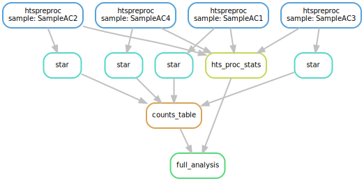

# Snakemake Pipeline for TagSeq and RnaSeq

## Some notes about the new pipeline: [See the new pipeline](snakefile.py)
1. Alter the `templates/tagseq.json`, `templates/pe.json`, `templates/se.json` file. Most importantly see **basename**.

    <pre class="prettyprint"><code class="language-pl" style="background-color:333333">
    {
        "__default__" :
        {
            "__comment1": "running_locally=[True,False] ~ type=[PE,SE,tagseq]",
            "running_locally" : "False",
            "type": "PE",8=
    
            "__comment2": "Path to the file containing a column of sample names",
            "samples_file": "pe_rnaseq/samples.txt"
        },
        "project": {
            "basename": "/share/biocore/keith/workshop/snakemake-tutorial/pe_rnaseq",
            "id": "PE",
            "fastqs": "00-RawData",
            "human_rrna_ref": "/share/biocore/keith/workshop/rnaseq_examples/References/human_rrna.fasta",
            "star_ref": "/share/workshop/msettles/rnaseq_example/References/star.overlap100.gencode.v31",
        },
        "hts_star" :
        {
            "__comment": "This is for running one sample for htspreproc > star",
            "job-name": "hts_star_",
            "n" : 1,
            "ntasks": 9,
            "partition": "production",
            "time" : "120",
            "mem": "32000",
    
            "__comment2": "The name of the sample and analysis type will be inserted before .out and .err",
            "output": "slurm_out/hts_star_.out",
            "error": "slurm_out/hts_star_.err",
            "mail-type": "ALL",
            "mail-user": "kgmitchell@ucdavis.edu"
        },
    }
    </code></pre>

2. Activate the proper version of snakemake:
    - `module load snakemake`
    - `source activate snakemake`    

3. Now you would likely want to run a set of samples (A) or an individual sample for a certain type of dataset (PE RNAseq,
    TAGseq, or SE RNAseq) so also be sure to specify the `type` as `PE`, `tagseq`, or `SE` in the respective json files. 
    - **A)** Run a set of samples:
        + Via list: `snakemake -s snakefile.py master_rule --configfile templates/pe.json --config samples=SampleAC1,SampleAC2,SampleAC3`
        + Via file (specified in .json): `snakemake -s snakefile.py master_rule --configfile templates/pe.json`
    - **B)** Run an individual sample:
        + `snakemake -s snakefile.py master_rule --configfile templates/pe.json --config samples=SampleAC1`
        
4. Finally for the samples that you have finished you will likely want to run stats on the hts processing and produce the counts.
    - **A)** Run a set of samples:
        + Via list: `snakemake -s snakefile.py full_analysis --config samples=SampleAC1,SampleAC2,SampleAC3`
        + Via file in (specified in .json): `snakemake hts_proc_stats --configfile templates/pe.json`
    - **B)** Run an individual sample:
        + `snakemake -s snakefile.py full_analysis --configfile templates/pe.json --config samples=SampleAC1`


5. A few extra notes about the pipeline: 
   - Master Rule:
        + The `master_rule` looks at the variable `running_locally` and submits the rule `all` as either an sbatch or
         a local call for the variable `False` and `True` respectively.
        + If `running_locally` is `False` be sure to edit the file `templates/tagseq.json`, `templates/pe.json`, 
        `templates/se.json` for the specific sbatch parameters for the job. 
    
   - Output:
        + If a job fails then the files marked as `output` for a rule will be removed.
    
   - Full analysis:
        + Uses the new `summarize_stats.py` which can generally handle PE, SE, and Tagseq data. 
        + [See summaryize_stats.py](summarize_stats.py)
        + `summarize_stats.py --help`
 
 
---

## Running the new workflow:

### Lets create a pdf of what our work flow will look like. 
```
snakemake -s snakefile.py full_analysis --configfile templates/pe.json --dry-run --dag | dot -Tsvg > rnaseq.svg
```
 


### Run 4 samples: (Pre Processing and STAR)
```
snakemake -s snakefile.py master_rule --configfile templates/pe.json
snakemake -s snakefile.py master_rule --configfile templates/se.json
snakemake -s snakefile.py master_rule --configfile templates/tagseq.json
```

### Once your jobs have finished run the rest of the rest of the analysis (HTS stats and Counts) 
```
snakemake -s snakefile.py full_analysis --configfile templates/pe.json
snakemake -s snakefile.py full_analysis --configfile templates/se.json
snakemake -s snakefile.py full_analysis --configfile templates/tagseq.json
```


### SIDE NOTE
 - we may get some funny stuff because we are submitting multiple snakemake calls in the same directory. Snakemake often does this as it locks files involved in the process.
 - to unlock the process (if you want to run multiple things in one directory and you trust yourself) the run `snakemake -s snakefile.py --unlock`     

