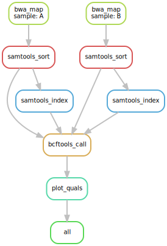

# Snakemake Introduction

## Overview

Snakemake is a flexible, python based workflow system. 
   - Workflows are sets of rules. (e.g `rule assembly:`)
   - Rule dependencies are determined in a systematic fashion by creating a directed acyclic graph (DAG) with the 
    ability of running rules in parallel. 
   - Each rule can consist of one or more of the following parts:
        + `input:` These files must be present for a rule to execute.
        + `output:` These files must be present following the execution of a rule for it to be considered "successful".
        + `shell:` or `run:` This is the code to be executed. Use shell for pure BASH or run for Pythonic implementations.
            - I prefer to use `run:` here while calling `shell()` within the python to implement BASH
        + `params:` Further specify variables for the use in `shell:` or `run:`' 
   - Wildcards can be used to expand rules across multiple samples along with the (e.g: `expand('somedir/{sample}.txt, sample=SAMPLES)`)
   - `input:`, `output:`, and `params:`" are accessible in the `shell:` or `run:` statements. 

Snakemake is different from other workflow systems (like CWL-Common workflow language) in the following ways:
   - Extension of python, which is a readable and user friendly language. 
   - Integrates with Conda allowing for easy reproducibility of environments. 
   - Workflow flexibility scales for running locally to HPC systems with ease.   


### Try to draw out what the DAG graph would be for the following snakemake example?

<pre class="prettyprint"><code class="language-py" style="background-color:333333">

SAMPLES = ["A", "B"]

rule all:
    input:
        "plots/quals.svg"


rule bwa_map:
    input:
        "data/genome.fa",
        "data/samples/{sample}.fastq"
    output:
        "mapped_reads/{sample}.bam"
    shell:
        "bwa mem {input} | samtools view -Sb - > {output}"


rule samtools_sort:
    input:
        "mapped_reads/{sample}.bam"
    output:
        "sorted_reads/{sample}.bam"
    shell:
        "samtools sort -T sorted_reads/{wildcards.sample} "
        "-O bam {input} > {output}"


rule samtools_index:
    input:
        "sorted_reads/{sample}.bam"
    output:
        "sorted_reads/{sample}.bam.bai"
    shell:
        "samtools index {input}"


rule bcftools_call:
    input:
        fa="data/genome.fa",
        bam=expand("sorted_reads/{sample}.bam", sample=SAMPLES),
        bai=expand("sorted_reads/{sample}.bam.bai", sample=SAMPLES)
    output:
        "calls/all.vcf"
    shell:
        "samtools mpileup -g -f {input.fa} {input.bam} | "
        "bcftools call -mv - > {output}"


rule plot_quals:
    input:
        "calls/all.vcf"
    output:
        "plots/quals.svg"
    script:
        "scripts/plot-quals.py"

</code></pre>

---

## Setup
Make sure you have a directory in the workshop folder (/share/workshop/$USER):
TODO: make this flexible for lab share

```
mkdir /share/workshop/$USER
```

Copy the materials for the intro and the tutorial:
``` 
cd /share/workshop/$USER
mkdir snakemake-tutorial
cp -r /share/biocore/keith/workshop/snakemake-tutorial/* snakemake-tutorial/
cd snakemake-tutorial
```

Now lets see what files we have here:

<div class="output">(snakemake) keithgmitchell@tadpole:/share/biocore/keith/workshop/snakemake-tutorial$ ls
data  mapped_reads  pe_rnaseq  se_rnaseq  slurm_out  snakefile	snakefile.py  summarize_stats.py  tagseq  templates
</div>

 - data, mapped_reads = mock data for the snakefile to use (basic tutorial snakemake)
 - pe_rnaseq, tagseq, se_rnaseq = mock data for the snakefile.py to use (the RNAseq workflow).
 - slurm_out = where the slurm job outputs will go. 
 - templates = JSON files for the snakefile.py 
 - summmarize_stats.py (for hts processing stats) 
 

---
 
## Brief Overview of Commands Using the Example Workflow

1. Prepare the environment for running snakemake:
    - `module load snakemake`
    - `source activate snakemake`

2. Run the snakemake file as a dry run (the example workflow shown above). 
    - This will build a DAG of the jobs to be run without actually executing them.
    - `snakemake --dry-run`

3. Executing rules of interest. 
    - `snakemake --dry-run all` VS. `snakemake --dry-run bcftools_call` VS. `snakemake --dry-run bwa_map`
    - Where is the wildcard specified?
    
4. Run the snakemake file and produce an image of the DAG of jobs to be run.
    - `snakemake --dag | dot -Tsvg > dag.svg` OR `snakemake --dag | dot -Tsvg > dag.svg`
        


---

## A few extra notes: 
   - The default file that snakemake looks for in the current working directory is the `snakefile`. If you would like to 
    override that you can specify it following the `-s`
        - `snakemake -s snakefile.py`
        - I like to keep the .py on my snakefiles so IDEs can generally interpret the python that is there.
   - Always helpful to use the `--dry-run` prior to running workflows!


